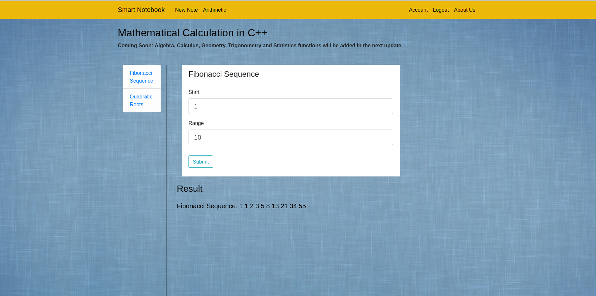

# SMART NOTEBOOK

Smart Notebook is a web application that provides an intuitive way to create and access notes. In addition, it
comes with a built-in translator to translate notes, written in any language, into French. It also
allows users to perform complex mathematical calculations. Smart Notebook follows all-in-one app philosophy to maximize user productivity.


## Instructions

#### Requirements
Docker & Docker Compose

#### To Run
```
1. git clone https://csil-git1.cs.surrey.sfu.ca/amacknoj/polygot.git
2. cd deployment
3. docker-compose build && docker-compose up
4. Go to http://localhost:8080/
```

#### To Terminate
```
1. docker-compose down -v
2. docker system prune -f
```

#### Demo Profile Credentials
```
User Name: Brett Macleod
Email: brett@live.com
Password: 123123123
```

#### Troubleshoot Instructions
Website and deployment both has been thoroughly tested but in case of an error, please try the following instructions:
```
1. docker-compose down -v
2. docker system prune -f
```
Clear browser cache and execute **To Run** instructions again.

## Features

#### Login/SignUp - Python Flask
Smart Notebook comes with login and signup functionality to securely store users' notes. Users must login to have full access of the website.


Signing up is just a one step process.


#### Create/Update/Delete Notes - Python Flask
Smart Notebook allow users to create new notes, update existing ones or delete notes. 


Click on note's title for more options. 


#### Mathematical Calculations - Python + C++
Smart Notebook allow users to perform complex mathematical calculations. It fetches input parameters and render result using **Python** but performs mathematical calculations using **C++**. 
**CTypes - a foreign function library for Python** is used for cross-language communication.
1. Fibonacci Sequence


2. Quadratic Roots


#### Real-Time Language Translation - Javascript + Python
Smart Notebook comes with a fascinating real-time language translator which can translate notes written in any language into French using Microsoft Azure translator. 
This features is implemented using **Javascript** and **Python**, leveraging **REST architecture** for cross-language communication. 

Current implementation can be easily extended to translate between **ANY** two languages.
1. Before Translation

2. After Translation


#### Additional Features
User can easily access and update account information. 


## Languages and Framework
1. C++ 
2. Python - Flask
3. HTML, CSS, Javascript - Bootstrap

## Cross-Language Communication
1. REST APIs to communicate between Javascript and Python
2. CTypes - Foreign function interface to communicate between C++ and Python

## Inspiration
1. Flask - https://www.youtube.com/user/schafer5
2. Docker - https://testdriven.io/blog/dockerizing-flask-with-postgres-gunicorn-and-nginx/
3. Translation via Azure - https://docs.microsoft.com/en-us/azure/cognitive-services/translator/quickstart-translate?pivots=programming-language-python