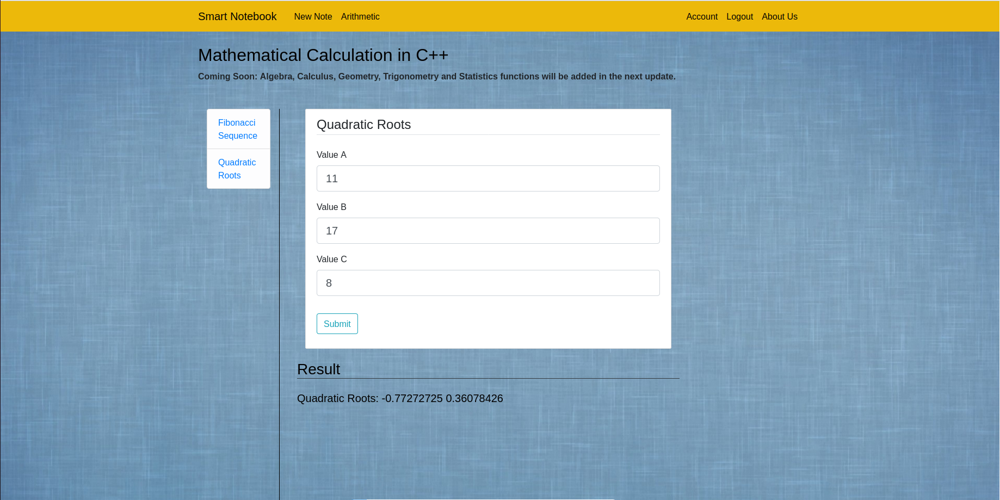

# SMART NOTEBOOK

Smart Notebook is a web application which provides an intuitive way to create and access notes.
It also support complex mathematical calculations.

## Instructions

#### Requirements
Docker & Docker Compose

#### To Run
```
1. git clone https://csil-git1.cs.surrey.sfu.ca/amacknoj/polygot.git
2. cd deployment
3. docker-compose build && docker-compose up
4. Go to http://localhost:8080/
```

#### To Terminate
```
1. docker-compose down -v
2. docker system prune -f
```

#### Demo Profile Credentials
```
User Name: Brett Macleod
Email: brett@live.com
Password: 123123123
```

## Features

#### Login/Logout - Python Flask


#### Create/Update/Delete Notes - Python Flask


#### Mathematical Calculations - Python + C++
This feature fetches input parameters and render result using Python but performs mathematical calculations using C++. 
CTypes - a foreign function library for Python was used for cross-language communication.
1. Fibonacci Sequence


2. Quadratic Roots


#### Language Translation - Javascript + Python
Translates notes written in any language into French using Azure translator in real-time. 
This features is implemented using Javascript and Python, leveraging REST for cross-language communication.


## Framework and Languages
1. C++ 
2. Flask - Python
3. Bootstrap - HTML, CSS, Javascript


## Inspiration
1. Flask - https://www.youtube.com/user/schafer5
2. Docker - https://testdriven.io/blog/dockerizing-flask-with-postgres-gunicorn-and-nginx/
4. Translation via Azure - https://docs.microsoft.com/en-us/azure/cognitive-services/translator/quickstart-translate?pivots=programming-language-python
3. Personal Project - https://csil-git1.cs.surrey.sfu.ca/amacknoj/orca